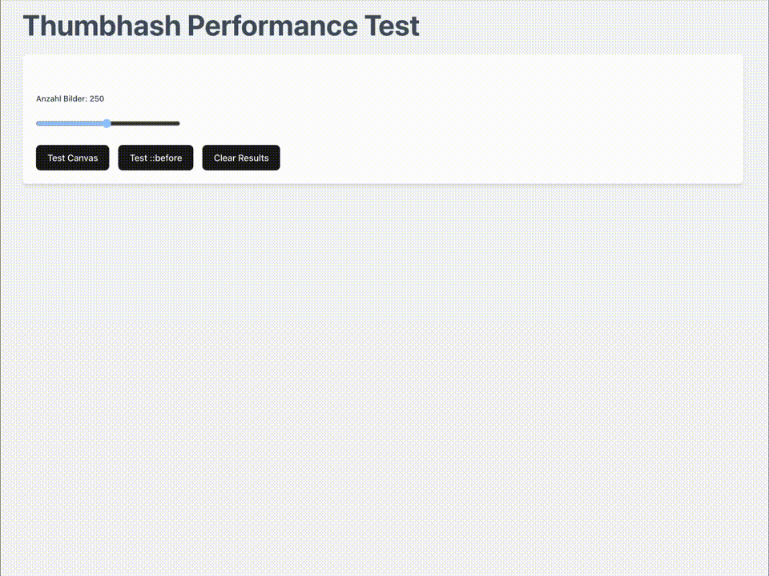

# ThumbHash Performance Test

Compare two ways of rendering [ThumbHash](https://evanw.github.io/thumbhash/) placeholders in React: **Canvas** (pixel buffer) vs **CSS wrapper** (`::before` + background-image). The app measures decode/render time for each approach and shows the real image once loaded.



## How it works

1. **Canvas**: Decode ThumbHash → RGBA pixels → draw on `<canvas>` with `putImageData`. Placeholder is a real canvas element.
2. **Wrapper**: Decode ThumbHash → Data URL (base64 PNG) → set as `background-image` on a `::before` pseudo-element via injected CSS. Placeholder is pure CSS.

Both then load the full image and fade from placeholder to image. The test records how long the decode/placeholder step takes per image and aggregates (total, average, min, max).

## How to use

1. **Run the app**
   ```bash
   npm install
   npm run dev
   ```
2. **Run a test**
   - Set image count (10–500).
   - Click **Test Canvas** or **Test ::before**.
   - Results appear below; images stay visible after the run.
3. **Compare**
   Run both tests to see the winner and difference in ms.

---

## Code examples: difference between the two approaches

### Approach A: Canvas

Decode to raw pixels and draw them on a canvas. No CSS image, no base64 string—just a pixel buffer.

```tsx
import { thumbHashToRGBA } from 'thumbhash';

// 1. Decode hash → width, height, RGBA buffer
const bytes = base64ToBytes(thumbHash);
const { w, h, rgba } = thumbHashToRGBA(bytes);

// 2. Draw on canvas
const ctx = canvas.getContext('2d');
canvas.width = w;
canvas.height = h;
const imageData = ctx.createImageData(w, h);
imageData.data.set(rgba);
ctx.putImageData(imageData, 0, 0);

// 3. Placeholder = <canvas> (blur/scale via CSS)
return <canvas ref={canvasRef} style={{ filter: 'blur(20px)', transform: 'scale(1.1)' }} />;
```

### Approach B: Wrapper (::before)

Decode to a Data URL string and use it as a CSS background. The placeholder is a `::before` pseudo-element, not a DOM node.

```tsx
import { thumbHashToDataURL } from 'thumbhash';

// 1. Decode hash → Data URL (base64 PNG string)
const bytes = base64ToBytes(thumbHash);
const dataUrl = thumbHashToDataURL(bytes);

// 2. Apply to ::before via injected CSS (can't set ::before from inline style)
// e.g. .thumb-wrapper[data-thumbhash="..."]::before { background-image: url("..."); }
injectRule(`.thumb-wrapper[data-thumbhash="${hash}"]::before { background-image: url("${dataUrl}"); }`);

// 3. Placeholder = ::before (blur/scale in CSS); no extra DOM node
return <div className="thumb-wrapper" data-thumbhash={hash}></div>;
```

**Summary:** Canvas = decode to pixels → draw on `<canvas>`. Wrapper = decode to Data URL → use as `background-image` on `::before`.
